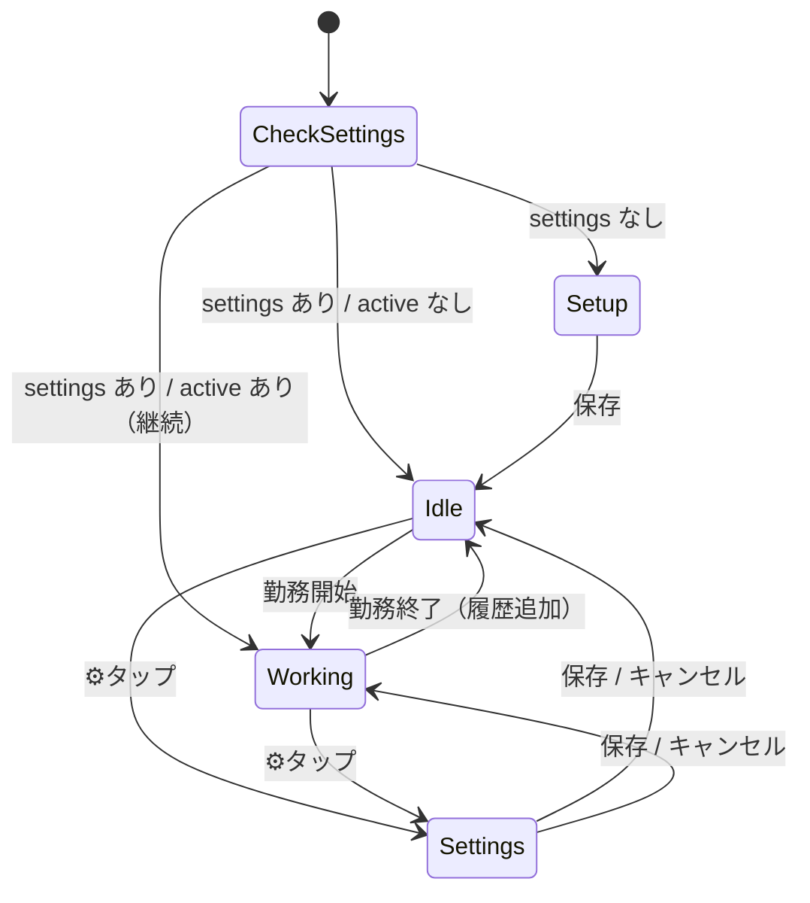

# 稼ぎカウント — 情報アーキテクチャ

仕事のモチベーション維持のために、勤務中に「いま稼いでいる金額」を1秒ごとにカウントアップ表示する個人用アプリ。

---

## 1. 概要

| 項目 | 内容 |
|---|---|
| 目的 | 勤務中の稼ぎをリアルタイム可視化し、モチベーションを維持する |
| ユーザー | 本人1名（個人専用） |
| デバイス | iPhone Safari（ホーム画面PWA） |
| データ保持 | 端末内（localStorage） |
| 認証 | なし（個人用・URLは本人のみが知る想定） |

---

## 2. 技術スタック

| レイヤ | 採用技術 | 選定理由 |
|---|---|---|
| フロントエンド | プレーンHTML + CSS + JS（単一ファイル） | ビルド不要・iOSで直接動く・PWA化容易 |
| データ永続化 | localStorage | 個人1端末・同期不要・実装ゼロコスト |
| ホスティング | GitHub Pages（Public Repo） | 無料・独自URL・git push で即デプロイ |
| フォント | Inter / Noto Sans JP（Google Fonts） | 金額表示の視認性とタブラー数字 |

**Firebase不採用理由**: 個人1端末利用・認証不要・リアルタイム同期不要のため、クラウド層は過剰。localStorageで完結する。

---

## 3. システム構成図

```mermaid
graph LR
  I[📱 iPhone Safari<br/>PWA]
  G[GitHub Pages<br/>{user}.github.io/work-motivation]
  R[GitHub Repo<br/>work-motivation]
  L[(localStorage)]

  I -->|HTTPS| G
  G -->|静的配信| H[index.html]
  H <-->|同期読み書き| L
  R -->|git push で更新| G
```

---

## 4. ホスティング・URL

| 種別 | URL / ID |
|---|---|
| リポジトリ名 | `work-motivation` |
| 公開URL | `https://{username}.github.io/work-motivation/` |

---

## 5. データモデル（localStorage）

すべてキーを `work-motivation:` でプレフィックスし、他アプリとの衝突を防ぐ。

### 5.1 `work-motivation:settings`
初期設定で入力する恒常的な値。

| フィールド | 型 | 説明 |
|---|---|---|
| `monthlySalary` | number | 月給（円） |
| `workDays` | number | 月の稼働日数（日） |

### 5.2 `work-motivation:active`
勤務中のみ存在。勤務終了時に削除される。

| フィールド | 型 | 説明 |
|---|---|---|
| `startedAt` | number | 開始時刻（`Date.now()`、ミリ秒） |

**再起動時の継続**: 画面再読み込みや端末再起動の後でもこのキーが残っていれば、`Date.now() - startedAt` でカウントを再計算して表示を継続できる。タイマーの状態を直接保存していないのがポイント。

### 5.3 `work-motivation:history`
勤務終了時に1エントリを追加する配列。

| フィールド | 型 | 説明 |
|---|---|---|
| `id` | string | `{startedAt}-{endedAt}` |
| `startedAt` | number | 勤務開始時刻（ミリ秒） |
| `endedAt` | number | 勤務終了時刻（ミリ秒） |
| `seconds` | number | 経過秒数 |
| `amount` | number | 獲得金額（円・整数） |

**保存のタイミング**: 「勤務終了」ボタン押下時にスナップショットとして保存。将来 `monthlySalary` や `workDays` を変えても過去の記録は変わらない（当時の金額を保持）。

---

## 6. 計算ロジック

```js
// 秒給 = 月給 ÷ (稼働日数 × 1日の労働時間 × 3600)
perSecond = monthlySalary / (workDays * 8 * 3600)

// 稼いだ金額 = 経過秒数 × 秒給（表示は Math.floor で整数円）
earned = (Date.now() - startedAt) / 1000 * perSecond
```

- 1日の労働時間は **8時間固定**
- 端数処理は表示時のみ `Math.floor`（内部計算は浮動小数で保持し精度を失わない）

### 計算例

| 月給 | 稼働日数 | 秒給 | 時給 | 日給 |
|---|---|---|---|---|
| 30万円 | 20日 | ¥0 (0.521) | ¥1,875 | ¥15,000 |
| 40万円 | 22日 | ¥0 (0.631) | ¥2,273 | ¥18,182 |

秒給は1円未満のため表示は ¥0 になるが、内部では浮動小数で累積するので2秒弱で1円刻みでカウントアップしていく。

---

## 7. 画面構成

```
稼ぎカウント App
├── Setup View           （初回起動時のみ・未設定時）
│   ├── 月給 input
│   ├── 稼働日数 input
│   └── 保存ボタン
│
└── Main View            （設定済み）
    ├── Header（ブランド名・設定アイコン）
    │
    ├── Counter Card
    │   ├── ラベル（「稼働中」or「勤務開始を押してください」）
    │   ├── 金額（巨大・金色・タブラー数字・1秒ごとにパルスアニメ）
    │   └── Sub Row
    │       ├── 経過時間（HH:MM:SS）
    │       └── 秒給
    │
    ├── Actions
    │   ├── 勤務開始ボタン（待機中のみ表示）
    │   └── 勤務終了ボタン（稼働中のみ表示）
    │
    ├── History
    │   ├── タイトル（「履歴」＋累計額）
    │   └── Entry × N（日付・経過時間・獲得金額・削除ボタン）
    │
    └── Settings Modal（下から出るシート）
        ├── 月給 / 稼働日数 input
        ├── 時給・秒給プレビュー
        └── 保存 / キャンセル
```

---

## 8. 状態遷移



### 稼働中の表示更新

- `setInterval(1000)` で1秒ごとに再計算・再描画
- 金額表示には150ms のパルスアニメで更新を可視化
- タブが裏に回ったら `visibilitychange` で `clearInterval`（バッテリー節約）
- フォアグラウンド復帰時に `startedAt` から差分で再計算して表示を巻き戻す

---

## 9. 永続化のポイント

- **タイマーオブジェクトは保存しない**。保存するのは開始時刻 `startedAt` のみ。
- 画面再読込・再起動しても、`startedAt` が残っていればそこから経過時間を再計算できる。
- 勤務終了を押し忘れて日を跨いでも、ユーザーが終了を押すまでカウントは続く（仕様）。

---

## 10. セキュリティ設計

| レイヤ | 対策 |
|---|---|
| 通信 | HTTPS（GitHub Pages） |
| データ | 端末内localStorageのみ、ネットワーク送信なし |
| URL | 公開だが本人以外には推測困難。機密データも入力しない想定 |

**認証なし**の理由: 個人1端末利用で、localStorageは端末を跨がない。他人が同じURLを開いても相手の端末のlocalStorageには何も入っていないので、データは他人から見えない。

---

## 11. ファイル構成

```
work-motivation/
├── index.html          … メインアプリ（単一ファイル完結）
├── ARCHITECTURE.md     … このドキュメント
└── .gitignore
```

---

## 12. 運用・保守

### セットアップ手順

1. GitHubで `work-motivation` リポジトリを作成（Public）
2. `index.html` / `ARCHITECTURE.md` / `.gitignore` をpush
3. Settings → Pages → Deploy from a branch → `main` / `/ (root)` → Save
4. iPhone Safariで `https://{username}.github.io/work-motivation/` を開く
5. 共有シート → 「ホーム画面に追加」
6. 初回起動時に月給・稼働日数を入力

### 更新フロー

```
コード編集（index.html）
  ↓
git commit + push
  ↓
GitHub Pages 自動デプロイ（30秒〜1分）
  ↓
iPhoneで再読込して反映
```

### トラブルシュート

| 症状 | 対処 |
|---|---|
| データが消えた | Safariの「サイトデータ」が削除されたとき発生。ホーム画面PWA化していれば永続性が上がる |
| 勤務終了を押し忘れた | 履歴から該当エントリを削除して手動記録を諦める、もしくは次回から気をつける |
| 設定を変えたい | 右上⚙から開いて変更。過去履歴の金額は変わらない |
| カウントが止まる | タブが裏に回ると停止（バッテリー節約）。復帰時に差分計算で続きから再開する |

---

## 13. 設計判断ログ

| 判断 | 採用案 | 却下案 | 理由 |
|---|---|---|---|
| データ層 | localStorage | Firestore | 個人1端末・認証不要・同期不要のため過剰 |
| 更新間隔 | 1秒ごと | 100msごと滑らか | ユーザー指示。パッと変わる爽快感優先 |
| タイマー保存 | `startedAt` のみ保存 | 累積秒数を定期保存 | 再起動で正確に継続できる・書き込み頻度ゼロ |
| 1日労働時間 | 8時間固定 | 入力可変 | 個人用途でシンプルさ優先 |
| 認証 | なし | Firebase Auth | 個人利用のためオーバースペック |

---

## 14. 拡張ポイント

| 機能 | 用途 | 難度 |
|---|---|---|
| PWA完全対応 | manifest.json + アイコン | 小 |
| 月次集計 | 月ごとの合計稼ぎ | 小 |
| 日給目標達成プログレスバー | 今日の目標到達率を視覚化 | 小 |
| 時給モード切替 | 残業時だけ時給で計算 | 中 |
| バイブ通知 | 目標金額到達時に震える | 中 |
| CSVエクスポート | 履歴のバックアップ | 小 |

---

## 15. 変更履歴

| 日付 | 変更 |
|---|---|
| 2026-04-16 | 初期実装・ARCHITECTURE.md 作成 |
